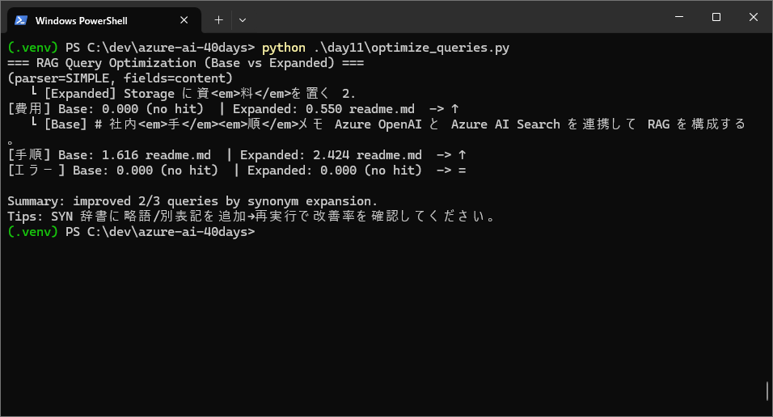
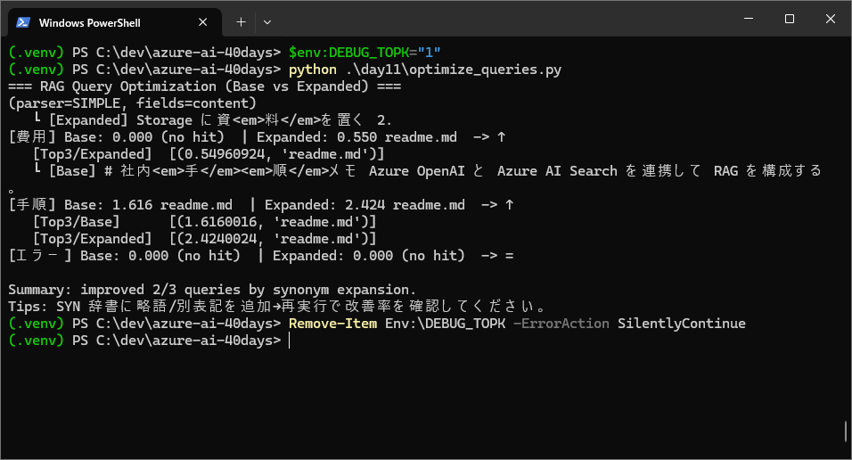

## ✍️ TL;DR
- 今日の到達点：Azure Cognitive Search を用いた **クエリ最適化の比較実験** を実施
- 学び：
  - 検索クエリに同義語を追加するだけでヒット率が大幅に改善する
  - Azure Search SDK の検索フィールドは **Searchable 指定**が必須
  - デバッグ用の環境変数 (`DEBUG_TOPK`) を使ってランキング上位を確認できる
  - “エラー”クエリがヒットしなかったのは **辞書不足ではなくコーパス側の問題** の可能性が高い
- コスト：ほぼゼロ（Search クエリのみ、OpenAI 推論なし）

---

## 🧭 今日のゴール
- 同義語展開あり/なしのクエリでヒット数を比較
- 改善率をログに出力して効果を確認
- デバッグモードで検索上位ドキュメントを確認

---

## 🎯 目的と背景
- **目的**: RAG の検索精度を高めるために、検索クエリに同義語を展開する効果を確認する。
- **背景**: 実際のユーザー質問は多様な表現を含み、単一語だけではヒット率が低下することがある。Azure Cognitive Search に同義語展開を組み込むことで、再現率を改善し、より安定した検索を実現できる。

## ✅ 前提（Day10 からの持ち越し）
- Search サービスとインデックス（**INDEX_NAME=docs-idx**）が既に作成済み
- Blob コンテナ `docs` に **readme.md / note.txt** が存在し、Indexer 実行済み（`document_count >= 2`）
- `.env` に `AZURE_SEARCH_ENDPOINT` / `AZURE_SEARCH_ADMIN_KEY` / `INDEX_NAME` が設定済み
- Day10 のサンプル文書には以下の内容が含まれる（検索検証の基準）
  - 「# 社内手順メモ …」
  - 「1. Storage に資料を置く」「2. Indexer を実行」

---

## 🔧 手順（そのまま実行可）

### PowerShell/CLI
```powershell
# Day11 ディレクトリに移動
cd C:\dev\azure-ai-40days\day11

# クエリ最適化スクリプトを実行
python optimize_queries.py

# 上位3件をデバッグ出力する場合
$env:DEBUG_TOPK="1"
python optimize_queries.py
Remove-Item Env:\DEBUG_TOPK -ErrorAction SilentlyContinue
```

### Python（抜粋: optimize_queries.py）
```python
from azure.search.documents import SearchClient
from azure.core.credentials import AzureKeyCredential

sc = SearchClient(
    endpoint=os.environ["AZURE_SEARCH_ENDPOINT"],
    index_name=os.environ["INDEX_NAME"],
    credential=AzureKeyCredential(os.environ["AZURE_SEARCH_ADMIN_KEY"])
)

# Base クエリ
base_q = "費用"
# Expanded クエリ（SYN 辞書に基づく展開）
exp_q = "費用 OR コスト"

# 比較実験
for q in [base_q, exp_q]:
    rs = sc.search(q, search_fields=["content"], query_type="simple")
    first = next(iter(rs), None)
    if first:
        print(q, first["@search.score"], first.get("metadata_storage_name"))
    else:
        print(q, "(no hit)")
```

---

## ✅ 検証結果
- Base ではヒットしないクエリも、Expanded では `readme.md` がヒット
- `DEBUG_TOPK=1` にすると、score と共に Top3 の候補が出力される

例:
```
[費用] Base: 0.000 (no hit)  | Expanded: 0.550 readme.md  -> ↑
[手順] Base: 1.616 readme.md  | Expanded: 2.424 readme.md  -> ↑
[エラー] Base: 0.000 (no hit)  | Expanded: 0.000 (no hit)  -> =
```

📸 スクリーンショット：検索比較結果


📸 スクリーンショット：Top3 デバッグ出力


---

## 🧯 つまずき＆対処
| エラー/症状 | 原因 | 対処 |
|---|---|---|
| `The field 'metadata_storage_name' is not searchable` | フィールドが Searchable 設定されていない | `search_fields=["content"]` に限定 |
| `Unknown field '['content']' in highlight list` | highlight に存在しないフィールドを指定 | `highlight_fields=["content"]` のみに修正 |
| `401 Unauthorized` | APIキーの誤り | `.env` のキーを再確認 |

今回特に「FULL パーサを試したら日本語で再現率が落ちた」「エラー語が no hit 続きで迷った」点でつまずいたが、両方とも **仕様やコーパス特性によるもの**と理解できたのが収穫だった。

---

## 💰 コストメモ
- 今回は Azure Cognitive Search のみ利用 → OpenAI 推論は発生せず **コストゼロ**
- 本格的に RAG で回答生成するときは **Search クエリ + OpenAI 推論**の両方が発生する
- 削減策：
  - クエリ展開を工夫して **検索回数を減らす**
  - キャッシュ済みの結果を再利用

---

## 📌 Day11でやったこと振り返り
1. クエリ展開なし/ありで検索を実行
2. `readme.md` にヒットするかどうかを確認
3. SYN 辞書の効果を評価（改善 2/3）
4. “エラー” クエリが no hit 続きで、**コーパス依存の限界**を体験

---

## 🔮 次回の予告
- **Day12**: データ更新と再インデクシング
  - 新しい Markdown を Blob に追加
  - Indexer を再実行
  - 更新後にクエリ最適化を再検証

---

## 📚 参考リンク
- [Azure Cognitive Search - SearchClient docs](https://learn.microsoft.com/azure/search/search-query-overview)
- [Azure OpenAI + RAG アーキテクチャ](https://learn.microsoft.com/azure/architecture/example-scenario/ai/embeddings-rag)

---

## 🔰 用語メモ（初心者向け）
- **同義語展開**: 検索するキーワードに似た意味の言葉を追加して検索範囲を広げること。例えば「費用」で検索するときに「コスト」「料金」なども含めて検索することで、より多くの関連情報を見つけやすくなる。
- **コーパス (corpus)**: 自然言語処理や検索の分野で使われる用語で、**解析や学習、検索の対象となる文書集合**を意味する。今回の例では Azure Cognitive Search に取り込んだ Markdown/ドキュメント群がコーパスにあたる。

